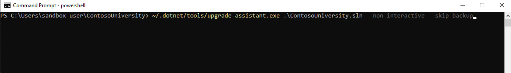
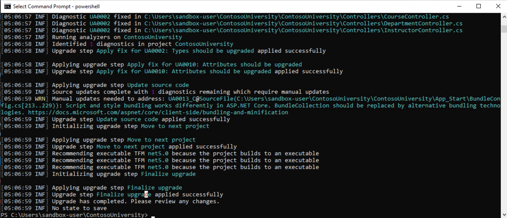
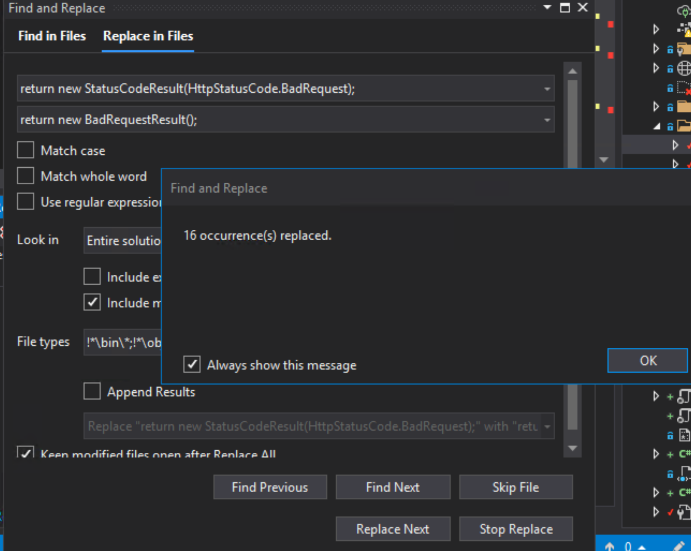
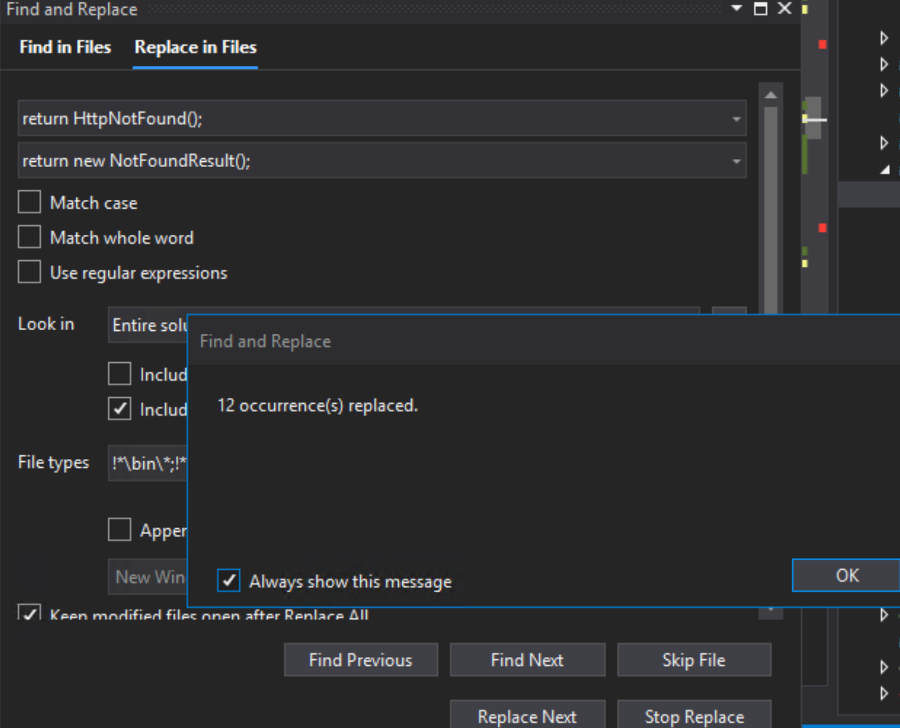
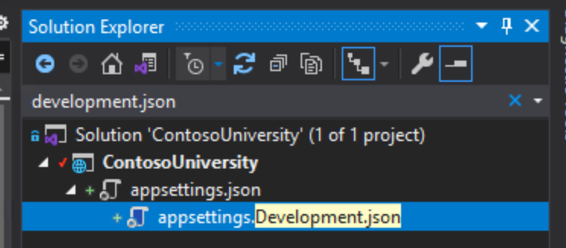
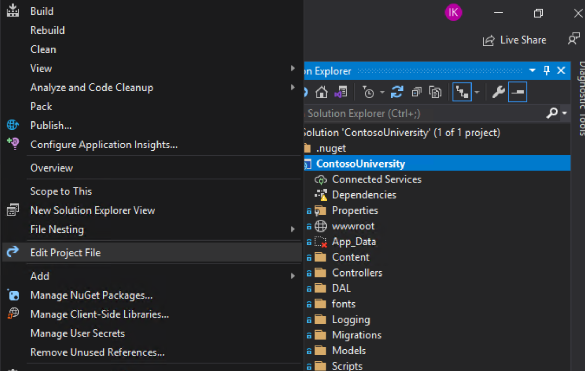

# Migrating ASP.NET MVC to ASP.NET Core MVC on Google Cloud

This tutorial shows you how to migrate [Contoso University](https://docs.microsoft.com/en-us/aspnet/mvc/overview/getting-started/getting-started-with-ef-using-mvc/creating-an-entity-framework-data-model-for-an-asp-net-mvc-application), a traditional Microsoft ASP.NET Framework MVC + Entity Framework sample that was built with .NET Framework 4.5 and EntityFramework 6.  In this tutorial, you migrate the Contoso University application to .NET 5 and run it in a Linux container on [Google Cloud Run](https://cloud.google.com/run), a fully serverless environment. You also use [Cloud SQL for SQL Server](https://cloud.google.com/sql-server), a managed Microsoft SQL Server 2017 database in Google Cloud. The migrated Contoso University application uses Google Diagnostics and Cloud Logging for ASP.NET Core as well as Google Secret Manager. This tutorial also and demonstrates how you can use Cloud Build to build the container and automatically deploy it to Cloud Run.

This tutorial provides end-to-end guidance on how to migrate the Contoso University application to .NET 5, including the specific changes that need to be applied to the application's original ASP.NET MVC code. For more detailed guidance about migrating from ASP.NET to ASP.NET Core, see the [Microsoft documentation](https://docs.microsoft.com/en-us/aspnet/core/migration/proper-to-2x/?view=aspnetcore-5.0).

### Table of Contents
* [Prerequisites](#Prerequisites)
* [Setup](#Setup) 
* [Migrate](#Migrate)
* [Refactor](#Refactor)
* [Using .NET 5 Configuration](#Using-.NET-5-Configuration)
* [Deploying to Google Cloud](#Deploying-to-Google-Cloud)
* [Using Google Secret Manager](#Using-Google-Secret-Manager)
* [Adding Google Cloud Logging & Monitoring](#Adding-Google-Cloud-Logging-&-Monitoring)
* [Putting it all together](#Putting-it-all-together)

# Prerequisites

1. Clone this repo and change to the working directory using the following commands.

    ```bash
    git clone https://github.com/saltysoup/ContosoUniversity

    cd ContosoUniversity
    ```

1. Provision the lab resources using [terraform](https://www.terraform.io/intro/index.html). If you don't have terraform installed locally, you can use Cloud Shell within the GCP Console. This deployment includes a GKE Windows Cluster, a dev sandbox VM w/ Visual Studio & all required binaries and a Cloud SQL instance. 

    ```bash
    cd terraform-sandbox-setup
    ```

1. Edit `versions.tf` to configure your GCS bucket to store terraform state by changing the value for `bucket`.

    ```bash
    terraform {
        ..
        backend "gcs" {
            bucket = "contosouniversity-tf"
            prefix = "terraform/state"
        }
        ..
    }
    ```

1. (Optional) Examine the `terraform.tfvars` file and update the values as desired.

1. Use terraform to provision the cloud resources.

    ```bash
    terraform apply
    ```

1. (Optional), you can also use terraform to clean up the cloud resources once you've finished the lab.

    ```bash
    terraform destroy
    ```

# Setup

### Once the resources successfully provision through terraform, [connect to your Windows VM](https://cloud.google.com/compute/docs/instances/connecting-to-windows) for the rest of the lab.

The following user account has been provisioned for you:
```
username: sandbox-user
password: Password123!
```
<br>

## **Setting up Cloud SQL for SQL Server**
In this section, you set up the application database within Google Cloud SQL for SQL Server instance.

1. Your Cloud SQL instance should already be provisioned in the [Prerequisites](#Prerequisites) section

1. [Create a database](https://cloud.google.com/sql/docs/sqlserver/create-manage-databases?hl=en_US>) and name it as follows: `ContosoUniversity` 

1. [Add a user](https://cloud.google.com/sql/docs/sqlserver/create-manage-users?hl=en_US) to connect to the database.    

1. Verify that the IP address that you want to connect to the database from is added to your [authorized networks](https://cloud.google.com/sql/docs/sqlserver/configure-ip?hl=en_US#console). Alternatively, for the purposes of this tutorial, you can allow all public IPs (0.0.0.0/0) to connect, as shown in the following screenshot:


## **Connect to the database**
In this section, you will be seeding the database from the dev sandbox created previously.

1. Within the newly created Windows sandbox VM, clone the repo again and switch to the `vm` branch.
    ```bash
    git clone https://github.com/saltysoup/ContosoUniversity

    git checkout vm
    ```

1. Open the `ContosoUniversity.sln` solution file with Visual Studio 2019.

1. Using the Cloud SQL Server IP address, database name, user and password you created preceding, modify your connection string in the `Web.config` file by replacing the placeholder values `<DBPUBLICIP>` `<DBUSER>` `<DBPWD>`:

   ```XML
   <connectionStrings>
     <add name="SchoolContext" connectionString="Data Source=<DBPUBLICIP>;Initial Catalog=ContosoUniversity;User ID=<DBUSER>;Password=<DBPWD>;" providerName="System.Data.SqlClient" />
   </connectionStrings>
   ```

1. In Visual Studio, open the Package Manager Console from the **View** menu -> **Other Windows** -> **Package Manager Console**. Enter the following command:

   ```powershell
   PM> update-database
   ```

This creates the schema and seeds the database with data automatically using Entity Framework and the `DAL\SchoolInitializer.cs` class.

<br>

## **Test the application**

Confirm the application builds and functions as desired before starting the migration.  
1. In Visual Studio 2019, press `Ctrl+F5` to build and run the project. 

1. You see the following home page:


1. Verify the application can access the database by selecting one of the tabs, for example, **Departments**.

<br>

# Migrate

In this section, you use the [.NET Upgrade Assistant](https://dotnet.microsoft.com/platform/upgrade-assistant/) to automate some steps of the migration to .NET 5. This will get you about 80% of the way there for this tutorial application. This automation is also a good starting point for most .NET Framework to .NET 5 upgrades. 

1. Close your Visual Studio instance

1. Open a powershell window in the solution folder where you extracted the sample, for example, `C:\Users\sandbox-user\ContosoUniversity`

1. Install the .NET Upgrade Assistant and dependents:
    ```cmd
    dotnet tool install -g try-convert
    dotnet tool install -g upgrade-assistant
    ```

1. Run the upgrade assistant:
    ```cmd
    ~/.dotnet/tools/upgrade-assistant.exe upgrade .\ContosoUniversity.sln --non-interactive --skip-backup
    ```

    

1. This should kick off the refactor process and complete in a few minutes.

    

The output of the Upgrade Assistant is the converted .NET 5 project.  A `log.txt` file contains a summary of the changes.  If you cloned the repository in an earlier step, you can get a more detailed comparision of the file differences after conversion with the following command:

```cmd
 git diff --stat vm upgraded

 ContosoUniversity/App_Start/BundleConfig.cs           |   4 +-
 ContosoUniversity/App_Start/FilterConfig.cs           |   4 +-
 ContosoUniversity/App_Start/RouteConfig.cs            |   3 -
 ContosoUniversity/ContosoUniversity.csproj            | 293 ++++++++++++---------------------------------------------------------------------------------
 ContosoUniversity/Controllers/CourseController.cs     |  11 ++--
 ContosoUniversity/Controllers/DepartmentController.cs |  11 ++--
 ContosoUniversity/Controllers/HomeController.cs       |   4 +-
 ContosoUniversity/Controllers/InstructorController.cs |  11 ++--
 ContosoUniversity/Controllers/StudentController.cs    |  11 ++--
 ContosoUniversity/DAL/SchoolInitializer.cs            |   1 -
 ContosoUniversity/Global.asax.cs                      |   4 --
 ContosoUniversity/Program.cs                          |  31 ++++++++++
 ContosoUniversity/Startup.cs                          |  67 ++++++++++++++++++++++
 ContosoUniversity/Views/_ViewImports.cshtml           |   3 +
 ContosoUniversity/appsettings.Development.json        |   9 +++
 ContosoUniversity/appsettings.json                    |  14 +++++
 ContosoUniversity/packages.config                     |  20 -------
 17 files changed, 185 insertions(+), 316 deletions(-)
(END)
```

# Refactor

In this section, you need to complete the refactoring by making some manual changes to get the application to enable you to build under .NET 5.  At this point, we recommend that you switch to [Visual Studio Code](https://code.visualstudio.com/) which is much lighter weight, open source IDE for developing in .NET Core. However, you can continue to use Visual Studio if you choose.

## Remove **App_Start\\\*.*** and **Global.asax**

The downloaded source code directory structure should resemble to following tree.  The root `\` of the directory contains the `ContainerUniversity.sln` solution file and the project directory is `.\ContosoUniversity\`:

```cmd
.
..
├── ContosoUniversity.sln
├── ContosoUniversity
│   ├── ContosoUniversity.csproj
│   ├── Global.asax
│   ├── Global.asax.cs
│   └── App_Start
│       └── BundleConfig.cs
│       ├── FilterConfig.cs
│       └── RouteConfig.cs
│   ├── Scripts
│   ├── Content
│   └── ...
|   ...

```

1. To use ASP.NET Core, you must remove all the files from the `ContosoUniversity\App_Start` directory as well as `ContosoUniversity\Global.asax*` files.

    ```powershell
    Remove-Item -Recurse ContosoUniversity\App_Start\*
    Remove-Item -Recurse ContosoUniversity\Global.asax*
    ```

1. [Bundling and minification](https://docs.microsoft.com/en-us/aspnet/core/client-side/bundling-and-minification?view=aspnetcore-5.0) changed in ASP.NET Core. Verify that the file `ContosoUniversity\App_Start\BundleConfig.cs` no longer exists.

1. To replace this, you use the `BuildBundlerMinifier` nuget package to bundle and minify at build time. Add the `BuildBundlerMinifier` package:
    ```powershell
    cd ContosoUniversity\
    
    dotnet add package BuildBundlerMinifier
    ```

1. Add a new file in the project directory `ContosoUniversity\bundleconfig.json` with the following contents to instruct `BuildBundlerMinifier` to create the necessary bundled files in the `wwwroot` directory at build time.  
    ```json
    [
        {
            "outputFileName": "wwwroot/css/styles.css",
            "inputFiles": [
                "Content/**/!(*.min).css"
            ]
        },
        {
            "outputFileName": "wwwroot/js/jquery.js",
            "inputFiles": [
                "Scripts/jquery-1.10.2.js",
                "Scripts/jquery-1.10.2.intellisense.js"
            ]
        },
        {
            "outputFileName": "wwwroot/js/bs-bundle.js",
            "inputFiles": [
                "Scripts/bootstrap.js",
                "Scripts/respond.js"
            ]
        },
        {
            "outputFileName": "wwwroot/js/modernizr.js",
            "inputFiles": [
                "Scripts/modernizr-2.6.2.js"
            ]
        }
    ]
    ```
    
1. As `@Scripts.Render` and `@Styles.Render` methods are not supported in .NET Core, we'll need to refactor our code to the new style.
<br><br>
Remove `@Scripts.Render` references (`-` lines below) from all `.cshtml` files and replace with the `+` lines below.  VS Code has built in support for regex in Find (`CTRL-F`) then press `ALT+R` to use regular expression mode and search for `(~/Content)|(~/bundles)`.  If you use Visual Studio it can be helpful to use `Find` dialog like this:
    

    In `Course/Create.cshtml`, `Course/Edit.cshtml`, `Department/Create.cshtml`, `Department/Edit.cshtml`, `Instructor/Create.cshtml`, `Instructor/Edit.cshtml`, `Student/Create.cshtml`, `Student/Edit.cshtml`
    ```diff
    - @section Scripts {
    -    @Scripts.Render("~/bundles/jqueryval")
    - }
    + <script src="~/js/jqueryval.js"></script>
    ```

    In `Shared/_Layout.cshtml`
    ```diff
    - @Styles.Render("~/Content/css")
    + <link href="~/css/styles.css" rel="stylesheet" />
    ```

    In `Shared/_Layout.cshtml`
    ```diff
    - @Scripts.Render("~/bundles/modernizr")
    + <script src="~/js/modernizr.js"></script>
    ```

    In `Shared/_Layout.cshtml`
    ```diff
    - @Scripts.Render("~/bundles/jquery")
    + <script src="~/js/jquery.js"></script>
    ```
    
    In `Shared/_Layout.cshtml`
    ```diff        
    - @Scripts.Render("~/bundles/bootstrap")
    + <script src="~/js/bs-bundle.js"></script>        
    ```

1. Delete `ContosoUniversity\App_Start\BundleConfig.cs` if you didn't already.

Routing and middleware in ASP.NET Core is configured in the new `ContosoUniversity\Startup.cs` file that was added by the .NET Upgrade Assistant which is documented in [App startup in ASP.NET Core](https://docs.microsoft.com/en-us/aspnet/core/fundamentals/startup?view=aspnetcore-5.0).

1. Verify that `ContosoUniversity\App_Start\RouteConfig.cs` and `ContosoUniversity\App_Start\FilterConfig.cs` has been deleted.

1. Verify that `ContosoUniversity\Global.asax` and `ContosoUniversity\Global.asax.cs` has been deleted.  See [this](https://docs.microsoft.com/en-us/aspnet/core/migration/proper-to-2x/?view=aspnetcore-5.0#globalasax-file-replacement) for more information.
    
## **Pagination**

The sample application uses the `PagedList.Mvc` library which you must replace with `PagedList.Core.Mvc`.
1. From the `ContosoUniversity` directory, replace the package with the following:
    ```cmd
    dotnet remove package PagedList.Mvc

    dotnet add package PagedList.Core.Mvc
    ```

1. In the `ContosoUniversity\Controllers\StudentController.cs` controllers replace the `using` reference:
    ```diff
    - using PagedList;
    + using PagedList.Core;
    ```

1. Update the `ContosoUniversity\Views\Student\Index.cshtml` file to change the references:
    ```diff
    - @model PagedList.IPagedList<ContosoUniversity.Models.Student>
    - @using PagedList.Mvc;
    + @model PagedList.Core.IPagedList<ContosoUniversity.Models.Student>
    + @using PagedList.Core.Mvc;
    ```

1.  Within the same file, replace the `PagedListPager` component:
    ```diff    
    - @Html.PagedListPager(Model, page => Url.Action("Index",
    -    new { page, sortOrder = ViewBag.CurrentSort, currentFilter = ViewBag.CurrentFilter })) 
    + <pager class="pager-container" list="@Model" asp-action="Index" asp-controller="Student" />     
    ```
<!-- 
TODO: Need to confirm if this is being bundled/changed: 
<link href="~/Content/PagedList.css" rel="stylesheet" type="text/css" />
-->

## **Return Results**

ASP.NET MVC Core uses different return result objects for the controller's action methods. In this application, there are many of these objects scattered throughout the `ContosoUniversity\Controllers\` classes.

Refactor these instances using the `Edit->Find and Replace->Replace in Files` function to replace:

* `return new StatusCodeResult(HttpStatusCode.BadRequest);` with `return new BadRequestResult();`

* `return HttpNotFound();` with `return new NotFoundResult();`

```diff
-                return new StatusCodeResult(HttpStatusCode.BadRequest);
+                return new BadRequestResult();
```


and: 

```diff
-                return HttpNotFound();
+                return new NotFoundResult();
```



## **TryUpdateModel** to **TryUpdateModelAsync**
The `TryUpdateModel` method is replaced by an `async` method in .NET 5.  To use this method, refactor the controllers:

* In `Controllers\CourseController.cs`
    ```diff
    +        using System.Threading.Tasks;
    ...
    -        public ActionResult EditPost(int? id)
    +        public async Task<ActionResult> EditPost(int? id)
    ...
    -            if (TryUpdateModel(courseToUpdate, "",
    -               new string[] { "Title", "Credits", "DepartmentID" }))
    +            if (await TryUpdateModelAsync(courseToUpdate))
    ...
    ```

* In `Controllers\DepartmentControllers.cs`
    ```diff
    +       using System.Threading.Tasks;
    ...
    -       TryUpdateModel(deletedDepartment, fieldsToBind);
    +       await TryUpdateModelAsync(deletedDepartment);
    ...
    -       if (TryUpdateModel(departmentToUpdate, fieldsToBind))
    +       if (await TryUpdateModelAsync(departmentToUpdate))
    ...
    ```

* In `Controllers\InstructorControllers.cs`
    ```diff
    +        using System.Threading.Tasks;
    ...
    -        public ActionResult Edit(int? id, string[] selectedCourses)
    +        public async Task<ActionResult> Edit(int? id, string[] selectedCourses)
    ...
    -       if (TryUpdateModel(instructorToUpdate, "",
    -       new string[] { "LastName", "FirstMidName", "HireDate", "OfficeAssignment" }))
    +       if (await TryUpdateModelAsync(instructorToUpdate))
    ...
    ```

* In `Controllers\StudentControllers.cs`
    ```diff
    +        using System.Threading.Tasks;
    ...
    -        public ActionResult EditPost(int? id)
    +        public async Task<ActionResult> EditPost(int? id)
    ...
    -            if (TryUpdateModel(studentToUpdate, "",
    -               new string[] { "LastName", "FirstMidName", "EnrollmentDate" }))
    +            // Note that you do not need to include the field names:
    +            if (await TryUpdateModelAsync(studentToUpdate))
    ...
    ```

## **Bind attribute**
You must make minor change in the `Bind` attribute in each of the controllers to remove the `Include=` parameter from the `Bind` attribute:

* In `Controllers\CourseController.cs`
    ```diff
    -       public ActionResult Create([Bind(Include = "CourseID,Title,Credits,DepartmentID")]Course course)
    +       public ActionResult Create([Bind("CourseID,Title,Credits,DepartmentID")]Course course)
    ```
* In `Controllers\DepartmentController.cs`
    ```diff
    -       public async Task<ActionResult> Create([Bind(Include = "DepartmentID,Name,Budget,StartDate,InstructorID")] Department department)
    +       public async Task<ActionResult> Create([Bind("DepartmentID,Name,Budget,StartDate,InstructorID")] Department department)
    ```
* In `Controllers\InstructorController.cs`
    ```diff
    -       public ActionResult Create([Bind(Include = "LastName,FirstMidName,HireDate,OfficeAssignment")]Instructor instructor, string[] selectedCourses)
    +       public ActionResult Create([Bind("LastName,FirstMidName,HireDate,OfficeAssignment")] Instructor instructor, string[] selectedCourses)
    ```
* In `Controllers\StudentController.cs`
    ```diff
    -       public ActionResult Create([Bind(Include = "LastName, FirstMidName, EnrollmentDate")]Student student)
    +       public ActionResult Create([Bind("LastName, FirstMidName, EnrollmentDate")] Student student)
    ```

## **SelectList**

The `SelectList` object is now part of the `Microsoft.AspNetCore.Mvc.Rendering` namespace, so you must update the `using` directive to the new namespace in every controller where `SelectList` is used.

* In `Controllers\CourseController.cs`
    ```diff
    +       using Microsoft.AspNetCore.Mvc.Rendering;
    ```
* In `Controllers\DepartmentController.cs`
    ```diff
    +       using Microsoft.AspNetCore.Mvc.Rendering;
    ```

## **Using .NET 5 Configuration**

In .NET 5, [configuration in ASP.NET Core](https://docs.microsoft.com/en-us/aspnet/core/fundamentals/configuration/?view=aspnetcore-5.0) isn't read from the `Web.config` configuration file, so you must move your connection string over to use one of the pluggable configuration providers which gives you more flexibility. However, the amount of flexibility will vary depending on the environment that you deploy the application to.

### **Add a connection string to appsettings**

1. Open the `ContosoUniversity\appsettings.json\appsettings.Development.json` file and copy your connection string from `Web.config`. 

    

    Your ConnectionStrings values should have been set previously in [Connect to the Database](#connect-to-the-database) section.

    ```shell
    {
        "Logging": {
            "LogLevel": {
                "Default": "Information",
                "Microsoft": "Warning",
                "Microsoft.Hosting.Lifetime": "Information"
            }
        },
        "ConnectionStrings": {
            "SchoolContext": "Data Source=<DBPUBLICIP>;Initial Catalog=ContosoUniversity;User ID=<DBUSER>;Password=<DBPWD>;"
        }
    }
    ```

1. ASP.NET Core [configures app behavior](https://docs.microsoft.com/en-us/aspnet/core/fundamentals/environments?view=aspnetcore-5.0) based on the runtime environment using an environment variable. Set `ASPNETCORE_ENVIRONMENT` to `Development` so that it will load the `appsettings.`**Development**`.json` file:
    
    Open a new shell, `View->Terminal` and run the following command
    ```cmd
    set ASPNETCORE_ENVIRONMENT=Development
    ```

1. Delete the `Web.config` file.

## **Use ASP.NET MVC Core Dependency Injection for configuration**

The best pattern to use a common service like the database context in ASP.NET Core is to use [Dependency Injection](https://docs.microsoft.com/en-us/aspnet/core/fundamentals/dependency-injection?view=aspnetcore-5.0). 

1. In `ContosoUniversity\DAL\SchoolContext.cs`, add a constructor to the `SchoolContext` class with the connection string as a parameter.

   ```diff
   ...
            public DbSet<Person> People { get; set; }
   +        public SchoolContext(string connectString) : base(connectString) {}
            protected override void OnModelCreating(DbModelBuilder modelBuilder)
   ...
   ```

1. In `ContosoUniversity\Startup.cs`, configure the service container to add the database context:
   ```diff
   +        using ContosoUniversity.DAL;
   ...
            {
            options.UseMemberCasing();
            });
   +        services.AddScoped<SchoolContext>(_ => 
   +        new SchoolContext(Configuration.GetConnectionString("SchoolContext"))
   +        );
            }
   ...
   ```

1. Finally, we need to change our controllers to consume this injected service. Make the following changes:

* In `Controllers\CourseController.cs`
    ```diff
    ...
            public class CourseController : Controller
            {
    -           private SchoolContext db = new SchoolContext();
    +           private SchoolContext db = null;
    +           public CourseController(SchoolContext db)
    +           {
    +               this.db = db;
    +           }
    ...
    ```

* In `Controllers\DepartmentController.cs`
    ```diff
    ...
            public class DepartmentController : Controller
            {
    -           private SchoolContext db = new SchoolContext();
    +           private SchoolContext db = null;
    +           public DepartmentController(SchoolContext db)
    +           {
    +               this.db = db;
    +           }
    ...
    ```

* In `Controllers\HomeController.cs`
    ```diff
    ...
            public class HomeController : Controller
            {
    -           private SchoolContext db = new SchoolContext();
    +           private SchoolContext db = null;
    +           public HomeController(SchoolContext db)
    +           {
    +               this.db = db;
    +           }
    ...
    ```
* In `Controllers\InstructorController.cs`
    ```diff
    ...
            public class InstructorController : Controller
            {
    -           private SchoolContext db = new SchoolContext();
    +           private SchoolContext db = null;
    +           public InstructorController(SchoolContext db)
    +           {
    +               this.db = db;
    +           }
    ...
    ```

* In `Controllers\StudentController.cs`
    ```diff
    ...
            public class StudentController : Controller
            {
    -           private SchoolContext db = new SchoolContext();
    +           private SchoolContext db = null;
    +           public StudentController(SchoolContext db)
    +           {
    +               this.db = db;
    +           }
    ...
    ```

## **Update Newtonsoft.Json version in project file** 
To use the `Microsoft.AspNetCore.Mvc.NewtonsoftJson` package, update the **Newtonsoft.Json** version from `9.0.1` to `12.0.2` in the project file.

```diff
-       <PackageReference Include="Newtonsoft.Json" Version="9.0.1" />
+       <PackageReference Include="Newtonsoft.Json" Version="12.0.2" />
```




## **Code Cleanup** 
As the final step and good practice, use the built-in Code Cleanup feature for consistent formatting and removing unnecessary `using` directives.

Navigate to the feature within Solution Explorer pane in Visual Studio, `Right Click->ContosoUniversity project->Analyze and Code Cleanup->Run Code Cleanup`

## **Congratulations!!**
You've now refactored the application to .NET 5.

## **Test the .NET 5 version**
Test the application by using the following command in a terminal from the `ContosoUniversity\` directory:

```cmd
dot net run
```

You should see the following output, which shows the application listening on ports 5000 & 5001.  If for some reason you can't use one of these ports, an easy alternative is to run `dotnet run -- --urls=http://localhost:3333` to run on port 3333 instead:
```cmd
info: Microsoft.Hosting.Lifetime[0]
      Now listening on: http://localhost:5000
info: Microsoft.Hosting.Lifetime[0]
      Now listening on: https://localhost:5001
info: Microsoft.Hosting.Lifetime[0]
      Application started. Press Ctrl+C to shut down.
info: Microsoft.Hosting.Lifetime[0]
      Hosting environment: Production
info: Microsoft.Hosting.Lifetime[0]
      Content root path: C:\repos\ContosoUniversity\ContosoUniversity
```

Open `http://localhost:5000` on a browser and the refactored application will connect to the Google Cloud SQL for SQL Server just as the .NET Framework version was. Go ahead and poke around in the application to test the functionality more thoroughly.

## **Deploying to Google Cloud**

Another benefit of moving to .NET 5 is that you can now run the application in a lightweight Linux container.  With Linux containers you can avoid the `it works on my machine` paradigm by encapsulating all of your dependencies in a small, portable format that can be run anywhere that can host a Docker container, including Kubernetes or fully serverless platforms like [Cloud Run](https://cloud.google.com/run).

## **Create the Dockerfile**

The next step is to create a Dockerfile which runs in a [.NET Docker container](https://docs.microsoft.com/en-us/dotnet/architecture/microservices/net-core-net-framework-containers/official-net-docker-images) created by Microsoft.

Create the `Dockerfile` file in the root solution directory. This directory is also where the `ContosoUniversity.sln` file resides:

```dockerfile
FROM mcr.microsoft.com/dotnet/sdk:5.0 AS build
WORKDIR /source
COPY ./ContosoUniversity /source
RUN dotnet publish -r linux-x64 --self-contained true -c Release -o /deploy

FROM mcr.microsoft.com/dotnet/runtime-deps:5.0 AS runtime

WORKDIR /app
COPY --from=build /deploy .

# Default port for Cloud Run
ENV ASPNETCORE_URLS="http://0.0.0.0:8080"

ENTRYPOINT ["/app/ContosoUniversity"]
```

In this step you use a Docker [multi-stage build](https://docs.docker.com/develop/develop-images/multistage-build/).  This guarantees that the build environment is always the same.  The output of the `build` stage is a [self-contained](https://docs.microsoft.com/en-us/dotnet/core/deploying/#publish-self-contained) executable that does not require .NET 5 to be installed, further reducing the image size and startup time.  The `runtime` stage copies only the runtime components necessary and sets a default URL to listen on as an environment variable.  The `ENTRYPOINT` is the name of the self-contained executable that was generated in the `build` stage.  

## **Build and run the container**
If you have Docker [installed](https://docs.docker.com/docker-for-windows/install/) on your local machine you can build and start the container with the following commands from the solution directory where you created the `Dockerfile`:

```cmd
docker build -t contosouniversity:v1 -f Dockerfile .

docker run -it contosouniversity:v1 -p 8080:8080
```

This command will run the application and expose port 8080 to the `localhost`, so that you can launch a browser at `http://localhost:8080` on your local machine to test.  

## **Using Cloud Build**

Rather than running Docker locally, you can use the managed [Cloud Build](https://cloud.google.com/build) service to build the container and automatically push it to your Google Container Registry.

1. Get your Google Cloud Project ID using the `gcloud` tool, for example:
    ```cmd
    gcloud config list

    [compute]
    region = us-central1
    [core]
    account = xyz@sample.com
    project = my-sample-project
    ```
    Don't worry if the project or region are not listed for you.  If you haven't previously set your default project,  log in to the [Google Cloud Console](https://console.cloud.google.com) and create your first project or get the name of an existing project.

1. Submit your artifacts to cloud build and tag the docker image. Replace  _my-sample-project_ with your own project name:
    ```cmd
    gcloud builds submit --tag gcr.io/_my-sample-project_/contosouniversity:v1
    ```
    Your complete Docker build now runs in the cloud and you should see the output of the build printed to your console while it runs.

## **Deploying to Cloud Run**

Now that you've built your container and published it to Google Container Registry, you can easily deploy the application to Cloud Run:

```cmd
gcloud run deploy --image gcr.io/_my-sample-project_/contosouniversity:v1 --platform managed --update-env-vars ASPNETCORE_ENVIRONMENT=Development
```

For a complete tutorial on Cloud Run with C#, see [Build and deploy a C# .Net Core service](https://cloud.google.com/run/docs/quickstarts/build-and-deploy/c-sharp).

## **Using Google Secret Manager**

While your application is now deployed and running, one issue is that your database connection string in `appsettings.json` are stored in plain text being shipped around with your source code.  To fix this in this section, you use [Secret Manager](https://cloud.google.com/secret-manager) to securely store the connection string.  If you are using Visual Studio Code at this point, you can use the [Cloud Code extension](https://cloud.google.com/code/docs/vscode/install) to easily create and manage secrets.

1. Install the extension and click on the Secret Manager icon:
    

1. Click to create a Secret and name it `connectionstrings` (use lowercase letters). Copy the `connectionStrings` block from `appsettings.Development.json`, including the leading and trailing curly braces:

   ```json
   {
      "ConnectionStrings": {
        "SchoolContext": "Data Source=1.1.1.1;Initial Catalog=ContosoUniversity;User ID=sqlserver;Password=XXXXX;"
      }
   }
   ```

1. Paste the `ConnectionStrings` json block into the value field, as shown in the following image, then click `Create Secret`:
    

1. There are multiple ways to read the secrets from your application, including using the [SDK API directly](https://cloud.google.com/secret-manager/docs/creating-and-accessing-secrets#secretmanager-create-secret-csharp). However, Cloud Run has [built-in support for Secrets](https://cloud.google.com/run/docs/configuring/secrets) which mount into the container as files at runtime. 

   In this step, you use Cloud Run to mount the connection string to: `/app/secret/appsettings.json`.  Because Cloud Run needs to mount the secrets into its own directory, you add some code for ASP.NET Core to optionally load config from this folder if it exists in `ContosoUniversity\Program.cs`:

    ```diff
            public static IHostBuilder CreateHostBuilder(string[] args) =>
                Host.CreateDefaultBuilder(args)
    +                .ConfigureAppConfiguration(AddSecretConfig)
                    .ConfigureWebHostDefaults(webBuilder =>
                    {
                        webBuilder.UseStartup<Startup>();
                    });
    ```
    Add the implementation of `AddSecretConfig`:
    ```csharp
            private static void AddSecretConfig(HostBuilderContext context, 
                IConfigurationBuilder config) 
            {
                const string secretsPath = "secrets";

                var secretFileProvider = context.HostingEnvironment.ContentRootFileProvider
                    .GetDirectoryContents(secretsPath);

                if (secretFileProvider.Exists)
                    foreach (var secret in secretFileProvider)
                        config.AddJsonFile(secret.PhysicalPath, false, true);
            }
        }
    ```

1. Give the `Secret Manager Secret Accessor` role to the Cloud Run service account. For instructions, see [the Cloud run documentation](https://cloud.google.com/run/docs/configuring/secrets#access-secret).

## **Adding Cloud Logging and Cloud Monitoring**
In this section, you centralize logging and monitoring.  It's common for Cloud Native applications to adopt the [Twelve-Factor App](https://12factor.net/logs) pattern and treat logs as streams.  ASP.NET Core by default [writes logs](https://docs.microsoft.com/en-us/aspnet/core/fundamentals/logging/?view=aspnetcore-5.0) to `stdout` as desired.  By default, all Cloud Run logs written to `stdout` by the container will be available in [Cloud Logging](https://cloud.google.com/logging).  However, [structured logging](https://cloud.google.com/logging/docs/structured-logging) allows you to make more sense of the logs, and  enabled easier querying, with machine and human readability.

There are several ways to get ASP.NET to automatically structure the logs without changing your logging code.  The easiest method is to configure the `Google.Cloud.Diagnostics.AspNetCore` package.

1. Add the package to your project
    ```cmd
    dotnet add package Google.Cloud.Diagnostics.AspNetCore
    ```

1. Modify `ContosoUniversity\Program.cs` to use this library:
    ```diff
            public static IHostBuilder CreateHostBuilder(string[] args) =>
                Host.CreateDefaultBuilder(args)
                    .ConfigureAppConfiguration(AddSecretConfig)
                    .ConfigureWebHostDefaults(webBuilder =>
                    {
    +                   if (webBuilder.GetSetting("ENVIRONMENT") == "Production")
    +                   {
    +                       webBuilder.UseGoogleDiagnostics();
    +                   }
                        webBuilder.UseStartup<Startup>();
                    });
    ```

   The application uses Cloud Logging only for production environments, such as when the application is deployed to Cloud Run. The `ENVIRONMENT` setting is controlled by the `ASPNETCORE_ENVIRONMENT` environment variable that you set earlier. If you don't set this variable, ASP.NET Core uses the value `Production` [By default](https://docs.microsoft.com/en-us/aspnet/core/fundamentals/environments?view=aspnetcore-5.0#environments).

## **Putting it all together**

At this stage, you're now using Cloud Build to build and publish rour container to Container Registry, Secret Manager to store the connection string, and Cloud Run to run your application.  To pull all of these actions together, in this section you  create the `cloudbuild.yaml` file to automate your build and deployment. Cloud Build can even be configured to run when you push to your git repository, for example to enable continuous integration and continuous deployment (CI/CD).  

1. Ensure you have the proper permissions for Cloud Build to deploy to Cloud Run. For instructions on how to enable Service Account permissions, see the [Deploying to Cloud Run How-to Guide](https://cloud.google.com/build/docs/deploying-builds/deploy-cloud-run#before_you_begin):


1. Ensure that the Cloud Run API is enabled and that you have created credentials


1. Alternatively, you can set permissions with the following script. This action is easiest if done from the Google Cloud Shell as it relies on bash.
    ```bash
    PROJECT_ID=`gcloud config list --format 'value(core.project)' 2>/dev/null`

    PROJECT_NUMBER=`gcloud projects describe $PROJECT_ID --format='value(projectNumber)'`

    gcloud projects add-iam-policy-binding $PROJECT_ID \
        --member "serviceAccount:$PROJECT_NUMBER@cloudbuild.gserviceaccount.com" \
        --role roles/run.admin

    gcloud iam service-accounts add-iam-policy-binding \
        $PROJECT_NUMBER-compute@developer.gserviceaccount.com \
        --member "serviceAccount:$PROJECT_NUMBER@cloudbuild.gserviceaccount.com" \
        --role "roles/iam.serviceAccountUser"    

    gcloud projects add-iam-policy-binding $PROJECT_ID \
        --role=roles/secretmanager.secretAccessor \
        --member=serviceAccount:$PROJECT_NUMBER-compute@developer.gserviceaccount.com
    ```

1. Create `cloudbuild.yaml` in the solution directory, as shown in the following code:

    ```yaml
    steps:
    # Build the container image
    - name: 'gcr.io/cloud-builders/docker'
      args: ['build', '-t', 'gcr.io/$PROJECT_ID/contosouniversity:$BUILD_ID', '.']
    # Push the container image to Container Registry
    - name: 'gcr.io/cloud-builders/docker'
      args: ['push', 'gcr.io/$PROJECT_ID/contosouniversity:$BUILD_ID']
    # Deploy container image to Cloud Run
    - name: 'gcr.io/google.com/cloudsdktool/cloud-sdk'
      entrypoint: gcloud
      args: 
      - 'beta'  
      - 'run'
      - 'deploy'
      - 'contosouniversity'
      - '--image'
      - 'gcr.io/$PROJECT_ID/contosouniversity:$BUILD_ID'
      - '--region'
      - 'us-central1'
      - '--platform'
      - 'managed'
      - '--allow-unauthenticated'
      - '--update-secrets=/app/secrets/appsettings.json=connectionstrings:latest'

    images:
    - gcr.io/$PROJECT_ID/contosouniversity:$BUILD_ID
    ```

1. Cloud Build will automatically substitute the `$PROJECT_ID` and `$BUILD_ID` when you run it. As an optional step, you can create a `.gitignore` file (note that the filename starts with a period (.) and has no extension)  When you check in files to git it will explicitly ignore these files and files that match these patterns.  Cloud Build leverages this functionality to ignore these files as well, so it's a good idea to create a `.gitignore` file at this stage:
    ```
    # Exclude local binaries
    .DS_Store/
    .vs/
    .vscode/
    **/bin/
    **/obj/
    **/wwwroot/
    **/appsettings.Development.json
    *.csproj.user

    # Exclude git history and configuration.
    .git/
    .gitignore

    # Compiled files
    *.tfstate
    *.tfstate.backup
    *.tfstate.lock.info

    # logs
    *.log

    # Directories
    .terraform/

    # SSH Keys
    *.pem

    # Backup files
    *.bak

    # Ignored Terraform files
    *gitignore*.tf
    ```

1. Submit the build from the solution directory:
    ```cmd
    gcloud builds submit
    ```

1. To check the status of your Cloud Run deployment, you can go to the Google Cloud Console or run the following command:
    ```cmd
    gcloud run services describe contosouniversity
    ```
## **What's Next?**

- Converting to .NET Core too much work for your workload? Check out building a [Windows Container and deploying to GKE](GKE.md) with no code changes.
