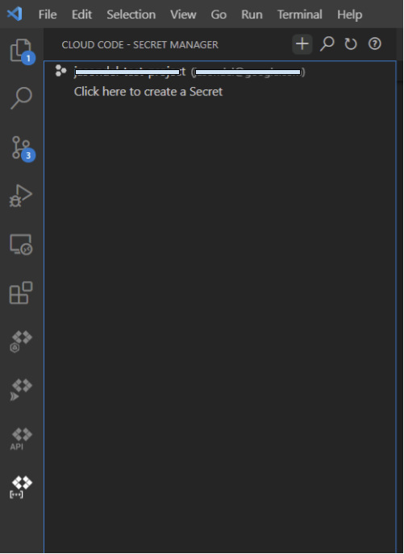

# Migrating ASP.NET MVC to ASP.NET Core MVC on GCP

This sample walks through a complete tutorial of migrating [Contoso University](https://docs.microsoft.com/en-us/aspnet/mvc/overview/getting-started/getting-started-with-ef-using-mvc/creating-an-entity-framework-data-model-for-an-asp-net-mvc-application), a traditional Microsoft ASP.NET Framework MVC + Entity Framework sample that was built with .NET Framework 4.5 and EntityFramework 6.  The goal of this tutorial will be to migrate this application to .NET 5 and run it in a Linux container on [Google Cloud Run](https://cloud.google.com/run), a fully serverless environment.  We also leverage [Cloud SQL for SQL Server](https://cloud.google.com/sql-server) a managed Microsoft SQL Server 2017 database in Google Cloud. The application uses Google Diagnostics and Cloud Logging for ASP.NET Core as well as Google Secret Manager and demonstrates using Cloud Build to build the container and automatically deploy to Cloud Run.

Microsoft [documentation](https://docs.microsoft.com/en-us/aspnet/core/migration/proper-to-2x/?view=aspnetcore-5.0) offers detailed guidance migrating from ASP.NET to ASP.NET Core and this is not meant to be a replacement, but this demonstrates a practical, end-to-end walkthrough.

### Table of Contents  
* [Prerequisites](#Prerequisites)   
* [Setup](#Setup) 
* [Migrate](#Migrate)
* [Refactor](#Refactor)
* [Deploying to Google Cloud](#Deploying-to-Google-Cloud)
* [Using .NET 5 Configuration](#Using-.NET-5-Configuration)
* [Using Google Secret Manager](#Using-Google-Secret-Manager)
* [Adding Google Cloud Logging & Monitoring](#Adding-Google-Cloud-Logging-&-Monitoring)
* [Putting it all together](#Putting-it-all-together)

## Prerequisites

1. Visual Studio 2019 – (Community Edition or any edition)

1. (Optional) [Install Docker](https://docs.docker.com/docker-for-windows/install/) on your local machine.  Don't worry if you cannot install Docker in your environment, we have a solution for you!

1. Install [.NET 5 SDK](https://dotnet.microsoft.com/download/dotnet/5.0)

1. Download and install the Google Cloud SDK following these [instructions](https://cloud.google.com/sdk/docs/install) or clone this repo.

## Setup

Either [Download the original Microsoft sample](https://webpifeed.blob.core.windows.net/webpifeed/Partners/ASP.NET%20MVC%20Application%20Using%20Entity%20Framework%20Code%20First.zip) and unzip it to a local directory, or clone this repository and checkout the `start` tag:

```cmd
git clone https://github.com/jjdelorme/ContosoUniversity

git checkout start
```

### Setup Cloud SQL for SQL Server

Start by setting up the Google Cloud SQL for SQL Server instance.  

1. [Create an instance](https://cloud.google.com/sql/docs/sqlserver/create-instance?hl=en_US>).  For the purposes of this tutorial you can use the SQL Server 2017 Express Edition which has $0 licensing costs.

1. [Create a database](https://cloud.google.com/sql/docs/sqlserver/create-manage-databases?hl=en_US>) named `ContosoUniversity` 

1. [Add a user](https://cloud.google.com/sql/docs/sqlserver/create-manage-users?hl=en_US) to connect to the database.    

1. Make sure that the IP you will be connecting to the database from is added to the [Authorized networks](https://cloud.google.com/sql/docs/sqlserver/configure-ip?hl=en_US#console) or for the purposes of this demo (**and never in production**), you can allow all public IPs (0.0.0.0/0) to connect:


### Connect to the database

Open `ContosoUniversity.sln` with Visual Studio 2019.

Using the Cloud SQL Server IP address, database name, user and password you created above, modify your connection string in the `Web.config` file:

```XML
  <connectionStrings>
    <add name="SchoolContext" connectionString="Data Source=1.1.1.1;Initial Catalog=ContosoUniversity;User ID=sqlserver;Password=XXXXX;" providerName="System.Data.SqlClient" />
  </connectionStrings>
```

In Visual Studio open the Package Manager Console from the **View** menu -> **Other Windows** -> **Package Manager Console** and entering this command:

```cmd
PM> update-database
```

This will create the schema and seed the database with data.  If you are interested in how this works, it's automatic done using Entity Framework and the `DAL\SchoolInitializer.cs` class.

### Test the application 

Confirm the application builds and functions as desired before staring the migration.  
1. From Visual Studio 2019 press `Ctrl+F5` to build and run the project. 

1. You should see the home page:


1. Verify it can access the database by clicking on one of the tabs, i.e. Departments.

## Migrate

We are going to use the [.NET Upgrade Assistant](https://dotnet.microsoft.com/platform/upgrade-assistant/) to automate some steps of the migration to .NET 5.  This will get us about 80% of the way there for this sample app and it is a good starting point for most .NET Framework to .NET 5 upgrades. 

1. Close your Visual Studio instance

1. Open a command prompt in the solution folder where you extracted the sample, i.e. `c:\repos\ContosoUniversity\`

1. Install the .NET Upgrade Assistant and dependents:
    ```cmd
    dotnet tool install -g try-convert
    dotnet tool install -g upgrade-assistant
    ```

1. Run the upgrade assistant
    ```cmd
    upgrade-assistant ContosoUniversity.sln --non-interactive --skip-backup
    ```

The output of the Upgrade Assistant will be the converted .NET 5 project.  A `log.txt` file will contain a summary of the changes.  *If* you cloned the repository to start with above, you can get a more detailed comparision of the file differences after conversion with this command:

```cmd
 git diff --stat start upgraded

 ContosoUniversity/App_Start/BundleConfig.cs           |   4 +-
 ContosoUniversity/App_Start/FilterConfig.cs           |   4 +-
 ContosoUniversity/App_Start/RouteConfig.cs            |   3 -
 ContosoUniversity/ContosoUniversity.csproj            | 293 ++++++++++++---------------------------------------------------------------------------------
 ContosoUniversity/Controllers/CourseController.cs     |  11 ++--
 ContosoUniversity/Controllers/DepartmentController.cs |  11 ++--
 ContosoUniversity/Controllers/HomeController.cs       |   4 +-
 ContosoUniversity/Controllers/InstructorController.cs |  11 ++--
 ContosoUniversity/Controllers/StudentController.cs    |  11 ++--
 ContosoUniversity/DAL/SchoolInitializer.cs            |   1 -
 ContosoUniversity/Global.asax.cs                      |   4 --
 ContosoUniversity/Program.cs                          |  31 ++++++++++
 ContosoUniversity/Startup.cs                          |  67 ++++++++++++++++++++++
 ContosoUniversity/Views/_ViewImports.cshtml           |   3 +
 ContosoUniversity/appsettings.Development.json        |   9 +++
 ContosoUniversity/appsettings.json                    |  14 +++++
 ContosoUniversity/packages.config                     |  20 -------
 17 files changed, 185 insertions(+), 316 deletions(-)
(END)

```

## Refactor

We'll now need to make some manual changes to get the application to succesfully build under .NET 5.  At this point many developers choose to switch to [Visual Studio Code](https://code.visualstudio.com/) which is much lighter weight and a rich, open source IDE for developing in .NET Core.  You can of course continue to use Visual Studio if you choose.

### Remove App_Start\\\*.* and Global.asax*

The downloaded source code directory structure should look like the tree below.  The root `\` of the directory contains the `ContainerUniversity.sln` solution file and the *project* directory is `.\ContosoUniversity\`:

```cmd
.
..
├── ContosoUniversity.sln
├── ContosoUniversity
│   ├── ContosoUniversity.csproj
│   ├── Global.asax
│   ├── Global.asax.cs
│   └── App_Start
│       └── BundleConfig.cs
│       ├── FilterConfig.cs
│       └── RouteConfig.cs
│   ├── Scripts
│   ├── Content
│   └── ...
|   ...

```

For ASP.NET Core we need to remove all the files from the `ContosoUniversity\App_Start` directory as well as `ContosoUniversity\Global.asax*` files.  Let's look at these files and the .NET 5 equivalent replacement.

* [Bundling and minification](https://docs.microsoft.com/en-us/aspnet/core/client-side/bundling-and-minification?view=aspnetcore-5.0) changed in ASP.NET Core, so you need to remove the file `ContosoUniversity\App_Start\BundleConfig.cs`.  To replace we're going to use the `BuildBunderlMinifier` nuget package to bundle and minify at build time.  This command must be run from the `ContosoUniversity` **project** folder:

    1. Add the package
        ```cmd
        cd ContosoUniversity\
        
        dotnet add package BuildBundlerMinifier
        ```

    1. Add a new file in the project directory `ContosoUniversity\bundleconfig.json` with the following contents to instruct `BuildBundlerMinifier` to create the necessary bundled files in the `wwwroot` directory at build time.  
        ```json
        [
                {
                        "outputFileName": "wwwroot/css/styles.css",
                        "inputFiles": [
                                "Content/**/!(*.min).css"
                        ]
                },
                {
                        "outputFileName": "wwwroot/js/jquery.js",
                        "inputFiles": [
                        "Scripts/jquery-1.10.2.js",
                        "Scripts/jquery-1.10.2.intellisense.js"
                        ]
                },
                {
                        "outputFileName": "wwwroot/js/bs-bundle.js",
                        "inputFiles": [
                        "Scripts/bootstrap.js",
                        "Scripts/respond.js"
                        ]
                },
                {
                        "outputFileName": "wwwroot/js/modernizr.js",
                        "inputFiles": [
                        "Scripts/modernizr-2.6.2.js"
                        ]
                }
        ]
        ```
    1. Remove `@Scripts.Render` references (`-` lines below) from all `.cshtml` files and replace with the `+` lines below.  If you use Visual Studio, it can be helpful to use `Find` with a regular expression of `(~/Content)|(~/bundles)`:
    

        ```diff
        - @section Scripts {
        -    @Scripts.Render("~/bundles/jqueryval")
        - }
        + <script src="~/js/jqueryval.js"></script>
        ```
        ```diff
        - @Styles.Render("~/Content/css")
        + <link href="~/css/styles.css" rel="stylesheet" />
        ```
        ```diff
        - @Scripts.Render("~/bundles/modernizr")
        + <script src="~/js/modernizr.js"></script>
        ```
        ```diff
        - @Scripts.Render("~/bundles/jquery")
        + <script src="~/js/jquery.js"></script>
        ```
        ```diff        
        - @Scripts.Render("~/bundles/bootstrap")
        + <script src="~/js/bs-bundle.js"></script>        
        ```

    1. Delete `ContosoUniversity\App_Start\BundleConfig.cs` if you didn't already.

* Routing and middleware in ASP.NET Core is configured in the new `ContosoUniversity\Startup.cs` file that was added by the .NET Upgrade Assistant which is documented in [App startup in ASP.NET Core](https://docs.microsoft.com/en-us/aspnet/core/fundamentals/startup?view=aspnetcore-5.0).

    1. Delete `ContosoUniversity\App_Start\RouteConfig.cs` and `ContosoUniversity\App_Start\FilterConfig.cs`.
    
    1. Delete `ContosoUniversity\Global.asax` and `ContosoUniversity\Global.asax.cs`.  See [this](https://docs.microsoft.com/en-us/aspnet/core/migration/proper-to-2x/?view=aspnetcore-5.0#globalasax-file-replacement) for more information.
    
### Pagination

Our sample application uses the `PagedList.Mvc` library which needs to be replaced with `PagedList.Core.Mvc`:
1. Replace the package
    ```cmd
    dotnet remove package PagedList.Mvc

    dotnet add package PagedList.Core.Mvc
    ```

1. In the `ContosoUniversity\Controllers\StudentController.cs` controllers replace the `using` reference:
    ```diff
    - using PagedList;
    + using PagedList.Core;
    ```

1. Update the `ContosoUniversity\Views\Student\Index.cshtml` file to change the references:
    ```diff
    - @model PagedList.IPagedList<ContosoUniversity.Models.Student>
    - @using PagedList.Mvc;
    + @model PagedList.Core.IPagedList<ContosoUniversity.Models.Student>
    + @using PagedList.Core.Mvc;
    ```

    and replace the `PagedListPager` component:
    ```diff    
    - @Html.PagedListPager(Model, page => Url.Action("Index",
    -    new { page, sortOrder = ViewBag.CurrentSort, currentFilter = ViewBag.CurrentFilter })) 
    + <pager class="pager-container" list="@Model" asp-action="Index" asp-controller="Student" />     
    ```
<!-- 
TODO: Need to confirm if this is being bundled/changed: 
<link href="~/Content/PagedList.css" rel="stylesheet" type="text/css" />
-->

### Return Results

ASP.NET MVC Core uses different return results for the controller's action methods.  Since there are many of these scattered throughout the `ContosoUniversity\Controllers\` classes this is best done with a `Search and Replace` in your IDE.  If you use Visual Studio, attempt to build the project and you will find these 

```diff
-                return new StatusCodeResult(HttpStatusCode.BadRequest);
+                return new BadRequestResult();
```
and 

```diff
-                return HttpNotFound();
+                return new NotFoundResult();
```

### TryUpdateModel to TryUpdateModelAsync
The `TryUpdateModel` method has been replaced by an `async` method in .NET 5.  To use this new method, there are several changes you need to make to each of the controllers including adding a using, changing the method to return `Task<ActionResult>` and `await`ing the result, for example:

```diff
+using System.Threading.Tasks;
...
-        public ActionResult EditPost(int? id)
+        public async Task<ActionResult> EditPost(int? id)

-            if (TryUpdateModel(courseToUpdate, "",
-               new string[] { "Title", "Credits", "DepartmentID" }))
+            // Note that you do not need to include the field names:
+            if (await TryUpdateModelAsync(courseToUpdate))
             ...
```

### Bind Attribute 
A minor change in the `Bind` attribute is required in each of the controllers to remove the `Include=` parameter from the `Bind` attribute, for example:

```diff
-        public ActionResult Create([Bind(Include = "CourseID,Title,Credits,DepartmentID")]Course course)
+        public ActionResult Create([Bind("CourseID,Title,Credits,DepartmentID")]Course course)
```        
Because each of these will be slightly different, it's best to search in your IDE for `[Bind(Include` and manually edit each one.

### SelectList

The `SelectList` object is now part of a different namespace, so you must add this using in controllers where `SelectList` is used, namely in the `ContosoUniversity/Controllers/CourseController.cs` and `ContosoUniversity/Controllers/DepartmentController.cs` files:

```diff
+using Microsoft.AspNetCore.Mvc.Rendering;
...
        // GET: Department/Create
        public ActionResult Create()
        {
            ViewBag.InstructorID = new SelectList(db.Instructors, "ID", "FullName");
            return View();
        }
```

## Using .NET 5 Configuration

[Configuration in ASP.NET Core](https://docs.microsoft.com/en-us/aspnet/core/fundamentals/configuration/?view=aspnetcore-5.0) is no longer read from `Web.config`, so we need to move our connection string over to to use one of the pluggable configuration providers.  

### Add connection string to appsettings

1. Open the `appsettings.Development.json` file and copy your connection string from `Web.config` like this:

    ```diff
    {
    "Logging": {
        "LogLevel": {
        "Default": "Information",
        "Microsoft": "Warning",
        "Microsoft.Hosting.Lifetime": "Information"
        }
    -  }
    +  },
    +  "ConnectionStrings": {
    +    "SchoolContext": "Data Source=1.1.1.1;Initial Catalog=ContosoUniversity;User ID=sqlserver;Password=XXXXX;"
    +  }
    +}
    ```
1. ASP.NET Core [configures app behavior](https://docs.microsoft.com/en-us/aspnet/core/fundamentals/environments?view=aspnetcore-5.0) based on the runtime environment using an environment variable.  Set `ASPNETCORE_ENVIRONMENT` to `Development` so that it will load the `appsettings.`**Development**`.json` file:
    ```cmd
    set ASPNETCORE_ENVIRONMENT=Development
    ```
1. Delete the `Web.config` file.

### Use ASP.NET MVC Core Dependency Injection for configuration

The old application relied on logic in EntityFramework to load from the `Web.config` file.  ASP.NET Core uses one or more [configuration providers](https://docs.microsoft.com/en-us/aspnet/core/fundamentals/configuration/?view=aspnetcore-5.0) which gives us much more flexiblity depending on the environment the application is deployed to.

The best pattern to use a common service like the database context in ASP.NET Core is to use [Dependency Injection](https://docs.microsoft.com/en-us/aspnet/core/fundamentals/dependency-injection?view=aspnetcore-5.0). 

1. Add a constructor to `ContosoUniversity\DAL\SchoolContext.cs` with the connectionString as a parameter.
```diff
+        public SchoolContext(string connectString) : base(connectString) {}
```

1. Configure the service container in `ContosoUniversity\Startup.cs` to add the database context.
```diff
+ using ContosoUniversity.DAL;
  ...
                {
                    options.UseMemberCasing();
                });

+            services.AddScoped<SchoolContext>(_ => 
+                new SchoolContext(Configuration.GetConnectionString("SchoolContext"))
+                );
         }
```

1. Change each of the `ContosoUniversity\controllers` to consume this injected service.  Repeat this pattern for each controller as demonstrated with `StudentController`:
```diff
    public class StudentController : Controller
    {
-        private SchoolContext db = new SchoolContext();
+        private SchoolContext db = null;
+
+        public StudentController(SchoolContext db)
+        {
+            this.db = db;
+        }
```

1. It's now time to test the application again.  Go ahead and `dotnet run` to ensure the application still connects to the database.

### Test the .NET 5 version

The application should now compile and run succesfully as a .NET 5 application.  To build and launch the migrated .NET 5 application, run this from the `ContosoUniversity\' directory:
```cmd
dotnet run
```
Which should respond with this output showing the application listening on ports 5000 & 5001.  If for some reason you cannot use one of those ports, an easy alternative is to run `dotnet run -- --urls=http://localhost:3333` to run on port 3333 instead.
```cmd
info: Microsoft.Hosting.Lifetime[0]
      Now listening on: http://localhost:5000
info: Microsoft.Hosting.Lifetime[0]
      Now listening on: https://localhost:5001
info: Microsoft.Hosting.Lifetime[0]
      Application started. Press Ctrl+C to shut down.
info: Microsoft.Hosting.Lifetime[0]
      Hosting environment: Production
info: Microsoft.Hosting.Lifetime[0]
      Content root path: C:\repos\ContosoUniversity\ContosoUniversity
```

You should now have your fully migrated .NET 5 application up and running again, connected to Google Cloud SQL for SQL Server just as you did with the .NET Framework version.  Go ahead and poke around in the application to test the functionality more thoroughly.

## Deploying to Google Cloud

Another great benefit of moving to .NET 5 is that you can now run the application in a lightweight Linux container.  With Linux containers, you can avoid the `it works on my machine` paradigm by encapsulting all of your dependencies in a small, portable format that can be run anywhere that can host a docker container, including Kubernetes or fully serverless platforms like Google Cloud Run.

### Create the Dockerfile

The next step will be to create a Dockerfile which runs in an [officially supported .NET Docker container](https://docs.microsoft.com/en-us/dotnet/architecture/microservices/net-core-net-framework-containers/official-net-docker-images).  

Create the `Dockerfile` file in the root solution directory, i.e. the same directory where the `ContosoUniversity.sln` file resides:

```dockerfile
FROM mcr.microsoft.com/dotnet/sdk:5.0 AS build
WORKDIR /source
COPY ./ContosoUniversity /source
RUN dotnet publish -r linux-x64 --self-contained true -c Release -o /deploy

FROM mcr.microsoft.com/dotnet/runtime-deps:5.0 AS runtime

WORKDIR /app
COPY --from=build /deploy .

# Default port for Cloud Run
ENV ASPNETCORE_URLS="http://0.0.0.0:8080"

ENTRYPOINT ["/app/ContosoUniversity"]
```

Here we are using a Docker [multi-stage build](https://docs.docker.com/develop/develop-images/multistage-build/).  This guarantees that the build environment is always the same.  The output of the `build` stage is a [self-contained](https://docs.microsoft.com/en-us/dotnet/core/deploying/#publish-self-contained) executable that does not require .NET 5 to be installed, further reducing the image size and startup time.  The `runtime` stage copies only the runtime components necessary and sets a default URL to listen on as an environment variable.  The `ENTRYPOINT` is the name of the self-contained executable that was generated in `build`.  

### Build and Run the container
If you have Docker [installed](https://docs.docker.com/docker-for-windows/install/) on your local machine you can build and start this container with the following commands from the solution directory where you created the `Dockerfile`:

```cmd
docker build -t contosouniversity:v1 -f Dockerfile .

docker run -it contosouniversity:v1 -p 8080:8080
```

This will run the application and expose port 8080 to the localhost, so that you can launch a browser at `http://localhost:8080` on your local machine to test.  

### Using Cloud Build

Rather than running Docker locally, you can use the managed Google Cloud Build service to build the container and automatically push it to your container registry.

1. Get your Google Cloud Project ID using the `gcloud` tool, for example:
    ```cmd
    gcloud config list

    [compute]
    region = us-east1
    [core]
    account = xyz@sample.com
    project = my-sample-project
    ```
    Don't worry if `project` or `region` are not listed for you.  If you haven't previously set your default project, just login to the [Google Cloud Console](https://console.cloud.google.com) and create your first project or get the name of an existing project.

1. Submit your artifacts to cloud build and tag the docker image (substituting _my-sample-project_ with your own):
    ```cmd
    gcloud builds submit --tag gcr.io/_my-sample-project_/contosouniversity:v1
    ```
    Your complete docker build will now run in the cloud and you should see the output of the build printed to your console while it runs.

### Deploying to Cloud Run

Now that you've built your container and published it to Google Container Registry, you can easily deploy the application to Google Cloud Run.  

```cmd
gcloud run deploy --image gcr.io/_my-sample-project_/contosouniversity:v1 --platform managed --update-env-vars ASPNETCORE_ENVIRONMENT=Development
```

For a complete tutorial on Cloud Run with C# see [this](https://cloud.google.com/run/docs/quickstarts/build-and-deploy/c-sharp).

## Using Google Secret Manager

While our application is now deployed and running, one issue is that our database connection string in `appsettings.json` are stored in plain text being shipped around with your source code.  To fix this we're going to use Google Secret Manager to securely store the connection string.  If you are using Visual Studio Code at this point, you can use the [Cloud Code extension](https://cloud.google.com/code/docs/vscode/install) to easily create and manage secrets.

1. Install the extension and click on the Secret Manager icon
    

1. Click to create a Secret and name it `connectionstrings` (all lowercase).  Copy the `connectionStrings` block from `appsettings.Development.json` including the leading and trailing curly braces:

```json
{
  "ConnectionStrings": {
    "SchoolContext": "Data Source=1.1.1.1;Initial Catalog=ContosoUniversity;User ID=sqlserver;Password=XXXXX;"
  }
}
```

1. Paste the `ConnectionStrings` json block into the value field like the figure below, then click `Create Secret`:
    

1. There are multiple ways to read these secrets from your application including using the [SDK API directly](https://cloud.google.com/secret-manager/docs/creating-and-accessing-secrets#secretmanager-create-secret-csharp).  However, Cloud Run has [built-in support for Secrets](https://cloud.google.com/run/docs/configuring/secrets) which mount into the container as files at runtime.  We're going to have Cloud Run mount the connection string to: `/app/secret/appsettings.json`.  Because Cloud Run needs to mount the secrets into it's own directory, we're going to add some code for ASP.NET Core to optionally load config from this folder if it exists in `ContosoUniversity\Program.cs`:

    ```diff
            public static IHostBuilder CreateHostBuilder(string[] args) =>
                Host.CreateDefaultBuilder(args)
    +                .ConfigureAppConfiguration(AddSecretConfig)
                    .ConfigureWebHostDefaults(webBuilder =>
                    {
                        webBuilder.UseStartup<Startup>();
                    });
    ```
    Now add the implementation of `AddSecretConfig`:
    ```csharp
            private static void AddSecretConfig(HostBuilderContext context, 
                IConfigurationBuilder config) 
            {
                const string secretsPath = "secrets";

                var secretFileProvider = context.HostingEnvironment.ContentRootFileProvider
                    .GetDirectoryContents(secretsPath);

                if (secretFileProvider.Exists)
                    foreach (var secret in secretFileProvider)
                        config.AddJsonFile(secret.PhysicalPath, false, true);
            }
        }
    ```
## Adding Google Cloud Logging & Monitoring
We're almost done with our cloud journey, but another necessary requirement in the cloud is to centralize logging and monitoring.  It is commond for Cloud Native applications to adopt the [Twelve-Factor App](https://12factor.net/logs) pattern and treat logs as streams.  ASP.NET Core by default [writes logs](https://docs.microsoft.com/en-us/aspnet/core/fundamentals/logging/?view=aspnetcore-5.0) to `stdout` as desired.  By default all Cloud Run logs written to `stdout` by the container will be avialable in Google Cloud Logging.  However, [structured logging](https://cloud.google.com/logging/docs/structured-logging) allows us to make more sense of the logs, easier querying with machine & human readability.  

There are several ways to get ASP.NET to automatically structure the logs without changing your logging code.  The easiest method is to configure the `Google.Cloud.Diagnostics.AspNetCore` package.

1. Add the package to your project
    ```cmd
    dotnet add package Google.Cloud.Diagnostics.AspNetCore
    ```

1. Modify `ContosoUniversity\Program.cs` to use this library:
    ```diff
            public static IHostBuilder CreateHostBuilder(string[] args) =>
                Host.CreateDefaultBuilder(args)
                    .ConfigureAppConfiguration(AddSecretConfig)
                    .ConfigureWebHostDefaults(webBuilder =>
                    {
    +                   if (webBuilder.GetSetting("ENVIRONMENT") == "Production")
    +                   {
    +                       webBuilder.UseGoogleDiagnostics();
    +                   }
                        webBuilder.UseStartup<Startup>();
                    });
    ```

1. You'll notice we only use this if we're running production as you don't want your production logs to get mixed with your local debugging or other envrionments.  This is also driven off the standard `ASPNETCORE_ENVIRONMENT` environment variable that we set earlier.  [By default](https://docs.microsoft.com/en-us/aspnet/core/fundamentals/environments?view=aspnetcore-5.0#environments) if you do not set this ASP.NET Core will use the value `Production`.

## Putting it all together

At this stage, we are now using Cloud Build to build and publish our container to Google Container Registry, Google Secret Manager to store the connection string and Cloud Run to run our application.  To pull this all together we're going to create `cloudbuild.yaml` to automate our build and deployment.  Cloud Build can even be configured to run when you push to your git repo for example to enable CI/CD.  

1. Ensure you have the proper permissions for Cloud Build to deploy to Cloud Run.  In the [Deploying to Cloud Run How-to Guide](https://cloud.google.com/build/docs/deploying-builds/deploy-cloud-run#before_you_begin) you will see instructions to enable Service account permissions:


1. Ensure that the Cloud Run API is enabled and that you have created credentials.


1. Create `cloudbuild.yaml` in the solution directory as below. Cloud Build will automatically substitute the `$PROJECT_ID` and `$BUILD_ID` when run. 

    ```yaml
    steps:
    # Build the container image
    - name: 'gcr.io/cloud-builders/docker'
    args: ['build', '-t', 'gcr.io/$PROJECT_ID/contosouniversity:$BUILD_ID', '.']
    # Push the container image to Container Registry
    - name: 'gcr.io/cloud-builders/docker'
    args: ['push', 'gcr.io/$PROJECT_ID/contosouniversity:$BUILD_ID']
    # Deploy container image to Cloud Run
    - name: 'gcr.io/google.com/cloudsdktool/cloud-sdk'
    entrypoint: gcloud
    args: 
    - 'beta'  
    - 'run'
    - 'deploy'
    - 'contosouniversity'
    - '--image'
    - 'gcr.io/$PROJECT_ID/contosouniversity:$BUILD_ID'
    - '--region'
    - 'us-east1'
    - '--platform'
    - 'managed'
    - '--update-secrets=/app/secrets/appsettings.json=connectionstrings:latest'

    images:
    - gcr.io/$PROJECT_ID/contosouniversity:$BUILD_ID
    ```

1. While not required, it's a good idea to create a `.gitignore` file (note that the filename starts with a period `.` and has no extension.)  When you check-in files to git it will explicitly ignore these files and files that match the patterns.  Cloud Build leverages this to ignore these files as well, so it's a good idea to create it now.
    ```
    .vscode/
    **/bin/
    **/obj/
    **/wwwroot/
    service_account.json
    **/appsettings.Development.json
    *.csproj.user

    # Exclude git history and configuration.
    .git/
    .gitignore
    ```

1. Submit the build from the solution directory
    ```cmd
    gcloud builds submit
    ```

1. To check the status of your Cloud Run deployment, you can go to the Google Cloud Console or run the following command:
    ```cmd
    gcloud run services describe contosouniversity
    ```
## What's Next?

- Converting to .NET Core too much work for your workload? Check out building a [Windows Container and deploying to GKE](GKE.md) with no code changes.
